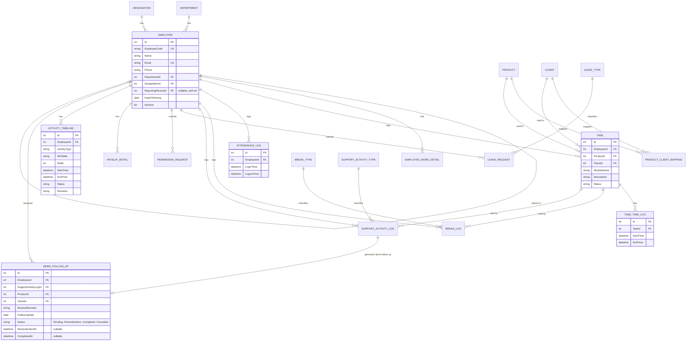

# RIMS – Project Blueprint (New Version)
**Single source of truth for design + AI-assisted build (Google Antigravity)**
Stack: ASP.NET Core 8 Web API · SQL Server · EF Core · React (TypeScript) · IIS (in-process, no reverse proxy)

---

## Table of Contents
1. [Project Overview & SRS Summary](#1-project-overview--srs-summary)
2. [System Architecture](#2-system-architecture)
3. [Database Design](#3-database-design)
4. [API Specification](#4-api-specification)
5. [UI/UX Screen Specifications](#5-uiux-screen-specifications)
6. [Business Rules](#6-business-rules)
7. [Project Roadmap](#7-project-roadmap)
8. [AI Build Prompts (Google Antigravity)](#8-ai-build-prompts-google-antigravity)
9. [IIS Deployment Guide](#9-iis-deployment-guide)
10. [Coding Standards](#10-coding-standards)
11. [Test Cases](#11-test-cases)

---

## 1. Project Overview & SRS Summary

RIMS is a workforce management platform with two portals:

- **Admin Portal** — master data (Employees, Products, Clients, Mapping), leave/permission approvals, attendance & payroll visibility, automated monthly reporting.
- **Employee Portal** — attendance tracking, task time tracking, break/support activity tracking, leave/permission requests, LOP-aware payslips, personal dashboards.

**User Roles:** `Admin`, `Employee` (an Employee can also be a "Reporting Person" for others — this is a relationship, not a separate role).

**Core non-functional principle:** Attendance (login/logout) time and Task productive time are tracked as **separate, independent streams**. Every task/break/support event is logged individually (start/end timestamp) into a shared `ActivityTimeline`, not just summarized into totals.

Full functional detail is in Sections 4–6 below; this section is the executive summary. (Your original SRS docx remains the detailed narrative reference — this blueprint is the buildable distillation of it.)

---

## 2. System Architecture

### 2.1 Hosting Model (No Reverse Proxy)

```
IIS Server
└── Site: RIIMS (Port 80/443)
    ├── /               → Frontend static build (React), IIS serves files directly
    └── /api            → Backend ASP.NET Core Web API, IIS Virtual Application,
                            AspNetCoreHostingModel = InProcess (ANCM in-process — no Kestrel proxy hop)
```

Frontend calls the backend via **relative `/api/...` URLs** — same origin, no CORS, no proxy config.

### 2.2 Tech Stack

| Layer | Technology |
|---|---|
| Backend | ASP.NET Core 8 Web API, C# |
| ORM | Entity Framework Core (Code-First + Migrations) |
| Database | SQL Server |
| Auth | ASP.NET Core Identity + JWT |
| Background Jobs | Hangfire (monthly report, daily grace-time evaluation) |
| Excel Export | ClosedXML |
| Email | SMTP |
| Frontend | React + TypeScript |
| API Docs | Swagger / Swashbuckle |
| Hosting | IIS, in-process, single site |

### 2.3 Solution Structure

```
RIIMS/
├── src/
│   ├── RIIMS.API/              # Controllers, Program.cs, appsettings.json
│   ├── RIIMS.Application/      # DTOs, services, business rules (LOP, grace time)
│   ├── RIIMS.Domain/           # Entities, enums
│   ├── RIIMS.Infrastructure/   # DbContext, EF migrations, repositories
│   └── RIIMS.Jobs/             # Hangfire recurring jobs
├── frontend/
│   ├── src/
│   ├── build/                  # deployed to IIS site root
│   └── web.config              # SPA rewrite rules
└── docs/
    └── RIIMS_Project_Blueprint.md   (this file)
```

### 2.4 Authentication Flow
1. `POST /api/auth/login` → validates credentials via ASP.NET Identity → issues JWT (role claim: Admin/Employee).
2. Frontend stores JWT (httpOnly cookie preferred over localStorage for XSS safety) and sends `Authorization: Bearer <token>` on each call.
3. Backend `[Authorize]` / `[Authorize(Roles="Admin")]` attributes gate every controller action.
4. Employee login **also** triggers `POST /api/attendance/login` to start that day's attendance clock (see §6).

---

## 3. Database Design

### 3.1 Entity Relationship Diagram



### 3.2 Core Tables — Fields, Keys, Indexes, Constraints

#### Employee
| Column | Type | Constraint |
|---|---|---|
| Id | int | PK, identity |
| EmployeeCode | nvarchar(20) | UNIQUE, NOT NULL |
| Name | nvarchar(150) | NOT NULL |
| Email | nvarchar(150) | UNIQUE, NOT NULL |
| Phone | nvarchar(20) | |
| DepartmentId | int | FK → Department.Id |
| DesignationId | int | FK → Designation.Id |
| ReportingPersonId | int | FK → Employee.Id (nullable, self-referencing) |
| DateOfJoining | date | NOT NULL |
| IsActive | bit | NOT NULL, default 1 |
| CreatedAt / UpdatedAt / CreatedBy | datetime / datetime / int | audit columns on all tables |

Indexes: `IX_Employee_Email` (unique), `IX_Employee_ReportingPersonId`.

#### EmployeeWorkDetail
`Id PK, EmployeeId FK, ShiftStart time, ShiftEnd time, WorkLocation, EmploymentType`
Index: `IX_EmployeeWorkDetail_EmployeeId`.

#### Product
`Id PK, Name nvarchar(150) NOT NULL, Code nvarchar(30) UNIQUE NOT NULL`

#### Client
`Id PK, CompanyName, CustomerName, AddressLine1, AddressLine2, Country, State, City, Pincode, PAN UNIQUE, GSTNo UNIQUE, HSN, CIN UNIQUE`
Index: `IX_Client_GSTNo`.

#### ProductClientMapping
`Id PK, ProductId FK, ClientId FK`
Constraint: `UQ_Product_Client (ProductId, ClientId)` — prevents duplicate mapping.

#### Task
`Id PK, EmployeeId FK, ProductId FK, ClientId FK, ModuleName, Description, Status enum(Running/OnHold/Completed), CreatedAt`
Index: `IX_Task_EmployeeId_Status`.

#### TaskTimeLog
`Id PK, TaskId FK, StartTime datetime NOT NULL, EndTime datetime NULL`
Constraint: only one row per TaskId with `EndTime IS NULL` at a time (enforced in service logic, not DB-level).
Index: `IX_TaskTimeLog_TaskId`.

#### BreakType / SupportActivityType / LeaveType
Simple lookup tables: `Id PK, Name nvarchar(50) UNIQUE NOT NULL`.

#### BreakLog
`Id PK, EmployeeId FK, BreakTypeId FK, HeldTaskId FK NULL (the task paused by this break), StartTime, EndTime`

#### SupportActivityLog
`Id PK, EmployeeId FK, ActivityTypeId FK, HeldTaskId FK NULL, ProductId FK NULL, ClientId FK NULL, Remarks nvarchar(500) NULL, StartTime, EndTime`
Constraint: Remarks/ProductId/ClientId NOT NULL when ActivityType ∈ {Call, Discussion, Meeting, Support Call, Demo} (enforced in service logic).

#### DemoFollowUp (Special Demo Support Activity Completion Workflow)
`Id PK, EmployeeId FK, SupportActivityLogId FK, ProductId FK, ClientId FK, ReviewRemarks nvarchar(1000) NOT NULL, FollowUpDate date NOT NULL, Status enum(Pending/ReminderSent/Completed/Cancelled) NOT NULL, ReminderSentAt datetime NULL, CompletedAt datetime NULL, CreatedAt datetime NOT NULL, UpdatedAt datetime NULL`
Index: `IX_DemoFollowUp_EmployeeId_Status`, `IX_DemoFollowUp_FollowUpDate`.

#### AttendanceLog
`Id PK, EmployeeId FK, LoginTime datetime NOT NULL, LogoutTime datetime NULL`
Index: `IX_AttendanceLog_EmployeeId_LoginTime`.

#### LeaveRequest
`Id PK, EmployeeId FK, LeaveTypeId FK, FromDate date, ToDate date, Reason nvarchar(500), Status enum(Pending/Approved/Rejected), ApprovedBy FK→Employee.Id NULL, ApprovedAt datetime NULL`

#### PermissionRequest
`Id PK, EmployeeId FK, RequestDate date, FromTime time, ToTime time, Reason, Status, ApprovedBy FK NULL, ApprovedAt NULL`

#### GraceTimeViolation
`Id PK, EmployeeId FK, Date date, LoginTime time, MinutesLate int`
Index: `IX_GraceTimeViolation_EmployeeId_Date`.

#### LOPCalculation
`Id PK, EmployeeId FK, Month int, Year int, LOPDays decimal(4,2), Reason nvarchar(200)`
Constraint: `UQ_LOP_Employee_Month_Reason`.

#### PayslipDetail
`Id PK, EmployeeId FK, Month int, Year int, BasicPay decimal(12,2), Deductions decimal(12,2), NetPay decimal(12,2), LOPDays decimal(4,2), LeavesTaken int, PermissionsUsed int, GraceViolations int`
Constraint: `UQ_Payslip_Employee_Month_Year`.

#### MonthlyReportLog
`Id PK, Month int, Year int, SentAt datetime, RecipientEmail nvarchar(150), FilePath nvarchar(300)`

#### ActivityTimeline (shared audit table — written to by Task/Break/Support modules)
`Id PK, EmployeeId FK, ActivityType nvarchar(30), RefTable nvarchar(50), RefId int, StartTime datetime, EndTime datetime NULL, Status nvarchar(20), Remarks nvarchar(500) NULL`
Index: `IX_ActivityTimeline_EmployeeId_StartTime`.

---

## 4. API Specification

All responses use envelope: `{ "success": bool, "data": {...}, "message": string, "errors": [] }`. All endpoints require `Authorization: Bearer <token>` unless marked public.

### 4.1 Auth
```
POST /api/auth/login          (public)
Request:  { "email": "a@x.com", "password": "***" }
Response: { "success": true, "data": { "token": "...", "role": "Employee" } }
```

### 4.2 Employee Master (Admin)
```
GET    /api/employees?page=1&pageSize=20
POST   /api/employees
PUT    /api/employees/{id}
GET    /api/employees/{id}/work-details
PUT    /api/employees/{id}/work-details
```

### 4.3 Product Master (Admin)
```
GET    /api/products
POST   /api/products
Request:  { "name": "RIIMS Core", "code": "PRD-001" }
Response: { "success": true, "data": { "id": 12 } }
PUT    /api/products/{id}
DELETE /api/products/{id}
```

### 4.4 Client Master (Admin)
```
GET    /api/clients
POST   /api/clients
PUT    /api/clients/{id}
DELETE /api/clients/{id}
```

### 4.5 Product–Client Mapping (Admin)
```
GET    /api/mappings?clientId=
POST   /api/mappings
Request: { "productId": 3, "clientId": 7 }
DELETE /api/mappings/{id}
```

### 4.6 Work Task (Employee)
```
POST /api/tasks/start
Request:  { "projectId": 1, "clientId": 2, "module": "Dashboard", "description": "Bug Fix" }
Response: { "success": true, "data": { "taskId": 45, "startTime": "2026-08-06T09:15:00" } }

POST /api/tasks/{id}/hold
Response: { "success": true }

POST /api/tasks/{id}/resume
Response: { "success": true, "data": { "taskId": 45, "resumedAt": "2026-08-06T09:40:00" } }

POST /api/tasks/{id}/complete
Response: { "success": true }

GET  /api/tasks/active/{employeeId}
GET  /api/tasks/history/{employeeId}?from=2026-07-01&to=2026-07-31
```

### 4.7 Break (Employee)
```
POST /api/breaks/start
Request:  { "breakTypeId": 2 }
Response: { "success": true, "data": { "breakLogId": 9, "heldTaskId": 45 } }

POST /api/breaks/{id}/stop
Response: { "success": true, "data": { "resumedTaskId": 45 } }
```

### 4.8 Support Activity & Demo Follow-Up (Employee)
```
POST /api/support/start
Request:  { "activityTypeId": 1 }
Response: { "success": true, "data": { "activityLogId": 20, "heldTaskId": 45 } }

POST /api/support/{id}/stop
Request:  { "remarks": "Discussed scope change", "productId": 3, "clientId": 7 }
Response: { "success": true, "data": { "resumedTaskId": 45 } }

POST /api/support/demo/complete
Request:  { "supportLogId": 20, "productId": 3, "clientId": 7, "reviewRemarks": "Product Demo for Client X", "followUpDate": "2026-08-15" }
Response: { "success": true, "data": { "activityLogId": 20, "demoFollowUpId": 4, "status": "Completed" } }

GET  /api/support/demo-followups/my-pending
Response: { "success": true, "data": [ { "id": 4, "productName": "Animate AI", "clientName": "Pricol", "reviewRemarks": "...", "followUpDate": "2026-08-15", "status": "Pending" } ] }

POST /api/support/demo-followups/{id}/complete
Response: { "success": true }
```
> `remarks`, `productId`, `clientId` are required in the stop payload when the activity type is Call, Discussion, Meeting, or Support Call.
> **Demo Special Workflow**: Completing a "Demo" activity requires `productId`, `clientId`, `reviewRemarks`, and `followUpDate`. It creates a `DemoFollowUp` reminder scheduled for automatic Hangfire notification on the `followUpDate`.

### 4.9 Attendance
```
POST /api/attendance/login    (called automatically on employee portal login)
POST /api/attendance/logout   (called automatically on employee portal logout)
GET  /api/attendance/{employeeId}?date=
```

### 4.10 Leave
```
POST /api/leaves
Request:  { "leaveTypeId": 1, "fromDate": "2026-08-10", "toDate": "2026-08-11", "reason": "Family function" }
Response: { "success": true, "data": { "leaveId": 15, "status": "Pending" } }

GET  /api/leaves/my
GET  /api/leaves/pending          (Admin)
PUT  /api/leaves/{id}/approve     (Admin)
PUT  /api/leaves/{id}/reject      (Admin)
```

### 4.11 Permission
```
POST /api/permissions
GET  /api/permissions/my
GET  /api/permissions/pending     (Admin)
PUT  /api/permissions/{id}/approve (Admin)
```

### 4.12 Payroll / LOP
```
GET /api/payroll/{employeeId}/{year}/{month}
Response:
{
  "success": true,
  "data": {
    "basicPay": 45000, "deductions": 1500, "netPay": 43500,
    "lopDays": 0.5, "leavesTaken": 2, "permissionsUsed": 1, "graceViolations": 3
  }
}

GET /api/payroll/admin/all?year=&month=   (Admin — all employees)
```

### 4.13 Dashboard
```
GET /api/dashboard/employee?from=&to=     (defaults to yesterday if no range given)
GET /api/dashboard/admin                  (all-employee production/non-production summary)
```

### 4.14 Reporting
```
POST /api/reports/monthly/run-now   (Admin — manual trigger, mainly for testing the scheduled job)
GET  /api/reports/monthly/history   (Admin — list of past generated/emailed reports)
```

### 4.15 Activity Timeline
```
GET /api/timeline/{employeeId}?date=2026-08-06
```

---

## 5. UI/UX Screen Specifications

### 5.1 Employee Dashboard
```
Layout: Top summary cards + task history table
----------------------------------------------
Cards: Today's Attendance (login time, live status)
       Yesterday Productive Hours
       Yesterday Non-Productive Hours
       [Date Range Picker] → refreshes both hour cards for a custom range
Section: Active Task widget (if any task running/on hold) — live timer, Hold/Complete buttons
Section: Task History table (Project, Client, Module, Duration, Date)
Section: Payslip summary card (previous month only) → "View Full Payslip" link
Navigation: Sidebar → Dashboard | Work Task | Leave | Permission | Payslip
Validation: Date range picker disallows future dates beyond yesterday for the hours cards.
```

### 5.2 Work Task Panel
```
Layout: Task creation form (top) + Active task timer (below)
Fields: Project (drag-drop from assigned list), Client (drag-drop from assigned list),
        Module (dropdown), Description (text area)
Buttons: [Start] — disabled until Project, Client, Module all selected
         [Hold] [Complete] — shown only when a task is active
Behavior: Starting a new task while one is running shows a confirmation toast
          ("Task X placed on hold") before starting the new one.
Validation: Description required, max 500 chars.
Navigation: accessible from Dashboard and its own sidebar item.
```

### 5.3 Break / Support Bar (persistent, visible across Employee Portal)
```
Layout: Fixed top or side bar with buttons: Bio Break | Tea Break | Lunch Break |
        Support Call | Call | Meeting | Discussion | Demo
Behavior: Clicking any button immediately holds the active task and starts that activity's timer;
          button becomes "Stop [Activity Name]" while active.

Popup A (Standard Support Activities: Call / Discussion / Meeting / Support Call):
        Fields: Product Name (dropdown, required), Client Name (dropdown, required), Remarks (required)
        Buttons: [Submit & Stop] (disabled until all fields filled) | [Cancel]

Popup B (Demo Special Completion Workflow):
        Fields: Product Name (dropdown, required), Client Name (dropdown, required),
                Review / Remarks (textarea, required), Follow-Up Date (date picker, required)
        Buttons: [Submit & Complete Demo] | [Cancel]
        Behavior: On submit, saves Demo activity, records timestamps, creates DemoFollowUp entity,
                  and auto-resumes previously held task.

Widget C (Pending Demo Follow-Ups Widget - Employee Portal):
        Shows pending follow-up reminders assigned to the logged-in employee.
        Fields displayed: Product Name, Client Name, Review/Remarks, Follow-Up Date, Status Badge (Pending / ReminderSent)
        Button: [Mark as Completed] → updates status to Completed and sets CompletedAt.
```

### 5.4 Leave Request (Employee)
```
Layout: Form (left) + Leave history/status table (right)
Fields: From Date, To Date, Leave Type (dropdown), Reason (text area)
Buttons: [Submit Request]
Table columns: From, To, Type, Status (Pending/Approved/Rejected badge), Applied On
Validation: To Date >= From Date; Reason required, max 300 chars.
Notification: Toast + in-app notification bell when status changes.
```

### 5.5 Payslip View (Employee)
```
Layout: Month selector (previous months only, current month hidden) + payslip detail card
Fields shown: Basic Pay, Deductions, Net Pay, LOP Days, Leaves Taken, Permissions Used, Grace Violations
Button: [Download PDF] (optional, if PDF export is added later)
```

### 5.6 Admin — Employee List / Registration
```
Layout: Data table (search, filter by Department) + [+ New Employee] button
Create/Edit Form: 3-tab layout
  Tab 1 "Registration": Employee Code, Name, Email, Phone, Department, Designation, Date of Joining
  Tab 2 "Reporting Person": searchable Employee picker
  Tab 3 "Work Details": Shift Start/End, Work Location, Employment Type
Validation: Email unique (server-checked on blur), all Tab 1 fields required.
```

### 5.7 Admin — Product Master / Client Master
```
Layout: Data table + [+ New] modal form
Product form: Name, Code (unique, uppercase auto-format)
Client form: all SRS §3.3 fields, grouped into "Company Info" / "Address" / "Statutory IDs" sections
Validation: GSTNo/PAN/CIN format-validated (regex) before submit.
```

### 5.8 Admin — Product–Client Mapping
```
Layout: Two-column assignment UI — Products list (left), Clients list (right),
        drag a Product onto a Client (or multi-select + "Map Selected" button)
        Mapped pairs shown as a table below with [Remove] action.
```

### 5.9 Admin — Leave/Permission Approval Queue
```
Layout: Tabs [Leave Requests] [Permission Requests], each a table:
        Employee, Type, Dates/Time, Reason, [Approve] [Reject] buttons
Behavior: Approve/Reject requires no extra popup (single click), triggers notification to employee.
```

### 5.10 Admin — Attendance & Payroll Dashboard
```
Layout: Employee-wise table: Name, Today's Login, Yesterday Prod. Hrs, Yesterday Non-Prod. Hrs,
        [View Payslip] link per row
Filter: Date range picker, Department filter
Section: "Generate Monthly Report Now" button (calls run-now endpoint, admin testing use)
```

---

## 6. Business Rules

1. Only one task can be actively running per employee at a time.
2. Starting a new Task, Break, or Support activity automatically holds the currently running task.
3. Stopping a Break or Support activity automatically resumes the task it held.
4. A Break pauses task time and counts as **Non-Productive** hours.
5. A Support activity (Call, Meeting, Discussion, Demo, Support Call) pauses task time but counts as **Productive** hours.
6. Call, Discussion, and Meeting require Remarks + Product + Client before they can be stopped.
7. Attendance (login/logout) time is tracked independently and is **never** paused by tasks, breaks, or support activities.
8. Every Task/Break/Support start-stop event is written to the shared Activity Timeline.
9. 1 paid leave allowed per calendar month; additional leave days in that month are Loss of Pay (LOP).
10. 1 permission (up to 1 hour) allowed per month, within the 10:00–11:00 or 18:00–19:00 windows.
11. Standard login grace time is 10:15.
12. More than 2 grace-time violations in a month → Half-Day LOP applied from the 3rd violation onward.
13. If a monthly permission is still available and login is at or before 10:17, that instance is offset against the permission instead of counted as a violation.
14. Employee dashboards show hour totals only up to **yesterday** — never the current, in-progress day.
15. Employee payslip view shows only **previous months** — never the current, in-progress month.
16. All master-data deletes are soft deletes (`IsActive = 0`); no hard deletes.
17. **Demo Follow-Up Workflow & Reminder Scheduling**:
    - Selecting "Demo" from the Support Module requires a special completion popup with 4 mandatory fields: Product Name, Client Name, Review / Remarks, and Follow-Up Date.
    - Submitting the Demo completion modal saves ProductId, ClientId, Review/Remarks, and FollowUpDate, records start/end timestamps, marks the activity as Completed, and auto-creates a `DemoFollowUp` entity with `Status = Pending`.
    - Hangfire scheduled recurring job runs daily (e.g. 08:00 AM UTC) to evaluate `DemoFollowUp` records where `FollowUpDate <= Today` and `Status == Pending`.
    - The job dispatches an automated email reminder to the employee (including Product Name, Client Name, Review/Remarks, and Follow-Up Date), updates status to `ReminderSent`, and records `ReminderSentAt`.
    - Pending follow-ups are displayed in the Employee Portal until the employee marks them as `Completed` (`CompletedAt = UtcNow`).
    - Standard support activities (Support Call, Call, Meeting, Discussion) retain their existing workflow without a Follow-Up Date.

---

## 7. Project Roadmap

| Phase | Scope |
|---|---|
| **Phase 1** | Foundation: auth, roles, IIS deployment pipeline proven end-to-end; Employee master + Attendance login/logout |
| **Phase 2** | Task Module: Work Task engine, Break engine, Support Activity engine, Demo Follow-Up Workflow & Hangfire Reminders, Activity Timeline |
| **Phase 3** | Leave & Permission: request forms, approval workflow, notifications |
| **Phase 4** | Payroll: Grace-time tracking, LOP calculation engine, Payslip generation |
| **Phase 5** | Reports & Dashboards: Employee dashboard, Admin dashboard, automated monthly Excel email job |
| **Phase 6** | Deployment: IIS production hardening, load testing, UAT sign-off |

---

## 8. AI Build Prompts (Google Antigravity)

### 8.1 Master Context Prompt (send once, first)

```
Project: RIIMS (Resource & Integrated Information Management System) – New Version

Stack:
- Backend: ASP.NET Core 8 Web API, C#, Entity Framework Core (Code-First), SQL Server
- Auth: ASP.NET Core Identity + JWT
- Background jobs: Hangfire
- Excel export: ClosedXML
- Frontend: React + TypeScript, calling backend via relative "/api" paths (same-origin, no CORS, no reverse proxy)
- Hosting: Single IIS site. Root "/" serves the frontend static build. "/api" is an IIS virtual application
  running the backend with AspNetCoreHostingModel=InProcess (no Kestrel reverse proxy).

Solution layout:
RIIMS.API (controllers, Program.cs) / RIIMS.Application (services, DTOs, business rules) /
RIIMS.Domain (entities, enums) / RIIMS.Infrastructure (DbContext, EF migrations, repositories) /
RIIMS.Jobs (Hangfire jobs) / frontend/ (React app, builds to /frontend/build)

Use the database design, API spec, business rules, and UI specs exactly as defined in the
"RIIMS Project Blueprint" document (Sections 3–6) — do not invent alternate schemas or endpoint shapes.

Global rules:
- All API responses use envelope: { success, data, message, errors }.
- All list endpoints support paging (page, pageSize) with total count.
- Server-side validation (FluentValidation) on every write endpoint.
- Every entity has CreatedAt, UpdatedAt, CreatedBy, IsActive (soft delete only, never hard delete).
- Roles: "Admin" and "Employee". Admin-only endpoints use [Authorize(Roles="Admin")].
- Every Task/Break/Support start-stop event also writes a row to ActivityTimeline.
- AttendanceLog and TaskTimeLog are separate tables — never merge or derive one from the other.
- No reverse proxy anywhere — frontend calls relative "/api/..." URLs only.
- EF Core migrations for every schema change; never hand-edit the database.
- Swagger enabled on the API for all endpoints.

I will give you one module at a time from the Blueprint's Section 4/5 breakdown. For each module produce:
1. Domain entities  2. EF Core config + migration  3. DTOs + service/business logic
4. API controller  5. React screen(s) wired to the endpoints
Wait for my "Module:" prompt before starting each one.
```

### 8.2 Per-Module Prompt Template

```
Module: [Name]
Goal: [one line]
Entities: [from Section 3.2]
Business rules: [relevant numbered rules from Section 6]
API endpoints: [from Section 4]
UI screen(s): [from Section 5]

Build this end-to-end (entity → EF config/migration → DTO/service → controller → React screen),
following the global rules from the master context. Show migration and controller code in full;
summarize repetitive CRUD boilerplate briefly.
```

Example (Work Task module) — fill the template using Section 3.2 (Task/TaskTimeLog), Section 6 (rules 1–3, 8), Section 4.6 (endpoints), Section 5.2 (screen).

---

## 9. IIS Deployment Guide

1. Publish backend with `<AspNetCoreHostingModel>InProcess</AspNetCoreHostingModel>` in the `.csproj`.
2. Install .NET Core Hosting Bundle + URL Rewrite Module on the server.
3. Create App Pool `RIIMS-API` — No Managed Code, identity with least-privilege SQL access.
4. IIS Site `RIIMS`: root → frontend build folder; Virtual Application `/api` → backend publish folder (pool: `RIIMS-API`).
5. Add `web.config` at frontend root: URL Rewrite fallback to `index.html` for SPA routes, excluding `/api/*`.
6. Frontend API base URL = relative `/api` (never an absolute host/port).
7. Connection string in `appsettings.Production.json` or environment variables.
8. Confirm Hangfire jobs run reliably under IIS in-process hosting; enable "Always On"/Application Initialization if the app pool recycles and jobs stop firing.
9. Smoke test: `https://yourdomain/` (frontend) and `https://yourdomain/api/swagger` (API) on the same origin.

---

## 10. Coding Standards

- C#: PascalCase for classes/methods/properties, camelCase for locals/parameters, `Async` suffix on async methods.
- One controller per module (matches Section 4 groupings); keep controllers thin — logic lives in `RIIMS.Application` services.
- DTOs only cross the API boundary — never expose EF entities directly in responses.
- All dates/times stored and transmitted in UTC; convert to local time only in the frontend.
- Consistent error handling via a global exception middleware, mapped to the `{ success:false, errors:[] }` envelope.
- React: functional components + hooks only; API calls centralized in a single `api/client.ts` (relative `/api` base URL) — no scattered `fetch` calls.
- Git: feature-branch per module (`feature/module-05-work-task`), PR review required before merge to `main`.

---

## 11. Test Cases

| # | Test Case | Steps | Expected Result |
|---|---|---|---|
| 1 | Employee Login | Log in with valid credentials | Attendance log created with LoginTime; JWT issued |
| 2 | Invalid Login | Log in with wrong password | 401, no attendance log created |
| 3 | Start Task | Fill task form, click Start | Task status=Running, TaskTimeLog opened, ActivityTimeline row written |
| 4 | Start Second Task | Start Task B while Task A running | Task A → OnHold (TaskTimeLog closed), Task B → Running |
| 5 | Lunch Break | Click Lunch Break while a task is running | Active task → OnHold, BreakLog opened, task timer stops |
| 6 | Stop Lunch Break | Click Stop on active break | BreakLog closed, previously held task auto-resumes with new TaskTimeLog |
| 7 | Start Meeting | Click Meeting | Active task held, SupportActivityLog opened |
| 8 | Stop Meeting without Remarks | Click Stop without filling popup | Submit blocked, validation error shown |
| 9 | Stop Meeting with Remarks | Fill Remarks/Product/Client, submit | SupportActivityLog closed, held task resumes |
| 10 | Complete Task | Click Complete on active task | Task status=Completed, TaskTimeLog closed |
| 11 | Employee Logout | Click Logout | AttendanceLog.LogoutTime set; any running task/break auto-closed per policy |
| 12 | Apply Leave (1st in month) | Submit 1-day leave request | Request created as Pending; on approval, no LOP applied |
| 13 | Apply Leave (2nd in month) | Submit a 2nd leave day in same month | On approval, 1 day counted as LOP |
| 14 | Apply Permission | Submit permission within allowed window | Request created; on approval, counted against monthly 1-hr allowance |
| 15 | Grace Time — Under Limit | Login twice after 10:15 in a month | No LOP applied (≤2 violations) |
| 16 | Grace Time — Over Limit | Login 3rd time after 10:15 in same month | Half-Day LOP applied |
| 17 | Grace Time — Permission Offset | Login at 10:16 with unused permission available | Counted against permission, not as a violation |
| 18 | Employee Dashboard — Current Day | Open dashboard today | Hours cards show yesterday's data only, not today's in-progress data |
| 19 | Employee Payslip — Current Month | Open payslip screen | Current month not listed; only previous months shown |
| 20 | Admin Monthly Report Job | Trigger scheduled/run-now job on 1st of month | Excel generated with all employees' leaves/permissions/grace/payslip data, emailed to Admin, logged in MonthlyReportLog |
| 21 | Product–Client Mapping Duplicate | Map same Product+Client twice | Second attempt rejected (unique constraint) |
| 22 | Soft Delete | Delete a Product | Record marked IsActive=0, not removed from DB, disappears from active lists |

---

## 12. Official Payslip Template Requirement

### 12.1 Visual Reference & Structural Layout
The official payslip generated by RIIMS must preserve the visual structure and layout of **Resh and Tosh Technologies Pvt. Ltd.**:

1. **PAYSLIP HEADER**:
   - Company Logo: *Resh & Tosh (Empowering Travel with Technology)*
   - Company Name: *Resh and Tosh Technologies Pvt. Ltd.*
   - Company Address: *The Address, Block A, 4 th Floor , No. 203/10B, 200 feet Radial Road,*
   - Month Bar: *Salary for the month of [Month Year]* (e.g. `Jun 26`)

2. **EMPLOYEE DETAILS**:
   - `Employee ID` | `{EmployeeCode}`
   - `Name` | `{EmployeeName}`
   - `Date of Joining` | `{DateOfJoining}`
   - `Designation` | `{DesignationName}`

3. **SALARY DETAILS (Earnings)**:
   - `Basic`
   - `HRA`
   - `Conveyance`
   - `Medical`
   - `Allowances`
   - `Arrears`
   - **`Total Salary ₹`**

4. **DEDUCTIONS**:
   - `LOP` (Calculated from RIIMS LOP Calculation Engine)
   - `ESI`
   - `PF`
   - `Parking Charges`
   - `TDS`
   - **`Total Deduction ₹`**

5. **FINAL SUMMARY & FOOTER**:
   - **`Net Salary ₹`**
   - Footer Notice: `"Computer Generated and no Signature Required"`

### 12.2 Technical & Security Rules
- All values must come dynamically from the RIIMS payroll database (`PayslipDetail` + `Employee` + `EmployeeWorkDetail` + `LOPCalculation`).
- `TotalSalary`, `TotalDeduction`, and `NetSalary` must be calculated dynamically.
- Associated with `EmployeeId`, `PayrollMonth`, and `PayrollYear`.
- **Security Rule**: Employees can only view and print their own payslips (`_currentUser.EmployeeId == employeeId`). Accessing another employee's payslip returns `403 Forbidden`.
- PDF generation / Print functionality via browser print stylesheet (`window.print()`).
